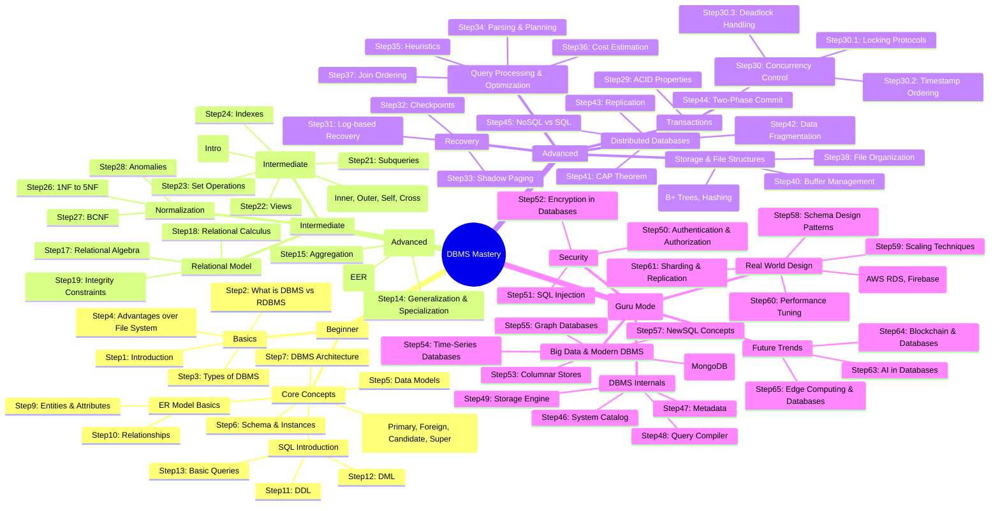

# DBMS Roadmap for newbies and experts.
A complete step-by-step roadmap to master Database Management Systems — from fundamentals to advanced concepts, using diagrams, lesson plans, and quizzes.

## Diagram to visualize the roadmap.

